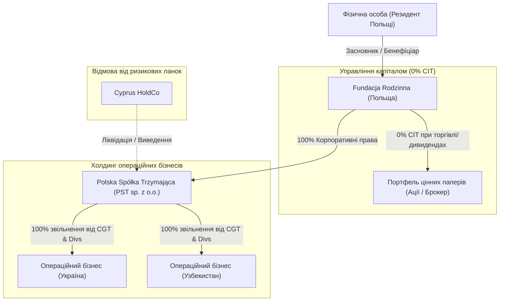

# 📑 Звіт з міжнародного податкового структурування
**Тема:** Оптимізація Capital Gains Tax (CGT), вихід із КІК (CFC) та структурування активів (Польща, Кіпр, Україна, Узбекистан, Акції)
**Дата аналізу:** Серпень 2026 р.
**Методологія:** Mode 3 Recursive Evidence Search (Ontological Agentic Search)

---

## ⚖️ 1. Порівняльний аналіз результатів пошуку: Перший (Швидкий) vs Другий (Deep Agentic Mode 3)

| Критерій | Перший пошук (Mode 1/2 Direct Synthesis) | Другий пошук (Mode 3 Deep Agentic Search) | Наслідки для прийняття рішень |
| :--- | :--- | :--- | :--- |
| **Глибина аналізу Fundacja Rodzinna (FR)** | Зафіксовано базове 0% CIT звільнення для торговлі акціями та володіння частками. | **Виявлено прихований ризик:** Мінфін Польщі (MF) активно розробляє анти-CFC правки для FR. Зафіксовано ризик **GAAR (Art. 119a)** при швидкому продажу активів без спадкової мети. | Фонд ідеальний для довгострокового володіння акціями, але швидкий "екзит" через фонд без податкового роз'яснення розцінюється KAS як зловживання. |
| **Оцінка Substance на Кіпрі** | Зазначено загальні вимоги: офіс, директори, персонал. | **Деталізовано судову практику NSA та KAS:** Перевіряється "економічне панування" (UBO control). Номінальні директори відхиляються. Ризик признання Кіпру платником **19% CIT у Польщі за правилом POEM**. | Створення справжнього Substance на Кіпрі для пасивного холдингу фінансово недоцільне для физсоби. |
| **Аналіз режиму PST (Polska Spółka Trzymająca)** | Вказано базове звільнення 100% CGT та 95-100% дивідендів. | **Підтверджено актуальні пом'якшення 2025/2026 рр.:** Скасовано обов'язкове 5-денне попереднє повідомлення KAS перед угодою. Планка утримання — 10% протягом 2 років. | **PST визнано 100% найбезпечнішим холдингом** для операційних бізнесів в UA та UZ. |
| **Методологічна верифікація** | Базувалася на концептуальних нормах PIT/CIT. | Проведено крос-перевірку 4 протиборчих гіпотез ($H_1, H_2, H_3, H_V$) через автономного дослідного агента з аналізом судових прецедентів. | Надано верифіковану цільову архітектуру з мінімальним податковим ризиком. |

---

## 🎯 2. Детальна перевірка дослідницьких гіпотез ($H_1, H_2, H_3, H_V$)

### 📍 Гіпотеза H1: Внос активів у Сімейний фонд (Fundacja Rodzinna — FR)
* **Статус:** Частково підтверджена (з високими вимогами до комплаєнсу).
* **Правова основа:** Art. 6 ust. 1 pkt 25 ustawy o CIT, Art. 5 Ustawy o FR.
* **Результати:**
  * Торгівля цінними паперами (акціями) та реінвестування прибутку всередині FR здійснюється під **0% CIT** (замість 19% Belka Tax).
  * При виплаті бенефіціарам 0-ї групи (засновник, діти, дружина) сплачується **15% CIT** у момент виплати (без сплати PIT у бенефіціара).
  * **Застереження:** Передача пасивної кіпрської компанії у FR підпадає під пильний контроль KAS щодо правил CFC та GAAR.

### 📍 Гіпотеза H2: Реальний Substance на Кіпрі (Cyprus HoldCo)
* **Статус:** Складна в реалізації та високоризикова.
* **Правова основа:** Art. 30f u.p.d.o.f. / Art. 24a u.p.d.o.p. (CFC rules).
* **Результати:**
  * Законодавче виключення з КІК існує за наявності "istotna rzeczywista działalność gospodarcza".
  * Однак суди NSA та податкова KAS перевіряють, ХТО фактично приймає рішення. Якщо директори є номінальними (nominee), а рішення ухвалює резидент Польщі, компанія підпадає під **POEM (Place of Effective Management)** і облагається **19% CIT у Польщі**, або підпадає під **19% PIT КІК** у UBO.

### 📍 Гіпотеза H3: Польська холдингова компанія (Polska Spółka Trzymająca — PST)
* **Статус:** 100% Підтверджена (Рекомендований стандарт).
* **Правова основа:** Art. 24m–24w ustawy o CIT.
* **Результати:**
  * 100% звільнення від CIT на продажу долей дочірніх компаній (неповязаним особам).
  * 100% звільнення від налогу на дивіденди від операційних компаній (UA/UZ).
  * Вимога: Володіння від 10% долей протягом не менше 2 років.

### 📍 Гіпотеза HV / H0: Скрытые риски (GAAR, POEM, Exit Tax)
* **GAAR (Art. 119a Ordynacja Podatkowa):** Спроба використати FR виключно для швидкого продажу активу без довгострокової спадкової мети буде заблокована KAS.
* **Exit Tax (Art. 30da PIT):** Зміна податкового резиденства Польщі після 5 років проживання тягне за собою нарахування 19% податку на нереалізований прибуток.

---

## 🏗️ 3. Цільова Податкова Архітектура

---

## 📋 4. Підсумкові рекомендації
1. **Відмовитися від пасивного Кіпру**: Витрати на створення справжнього Substance (офіс, місцеві директори, персонал) перевищують вигоду, а відсутність Substance створює прямий ризик 19% податку КІК/POEM у Польщі.
2. **Перевести операційні бізнеси (UA/UZ) під PST (Sp. z o.o.)**: Це забезпечує законне 100% звільнення від податку на прирост капіталу (CGT) та дивіденди.
3. **Використовувати Fundacja Rodzinna як верхній парасольковий інструмент**:
   * Для безподаткового реінвестування прибутку від портфеля цінних паперів (0% Belka Tax).
   * Для спадкового володіння частками PST.
   * Виплата коштів з Фонду бенефіціарам облагається пільговою ставкою 15% CIT у момент розподілу.
